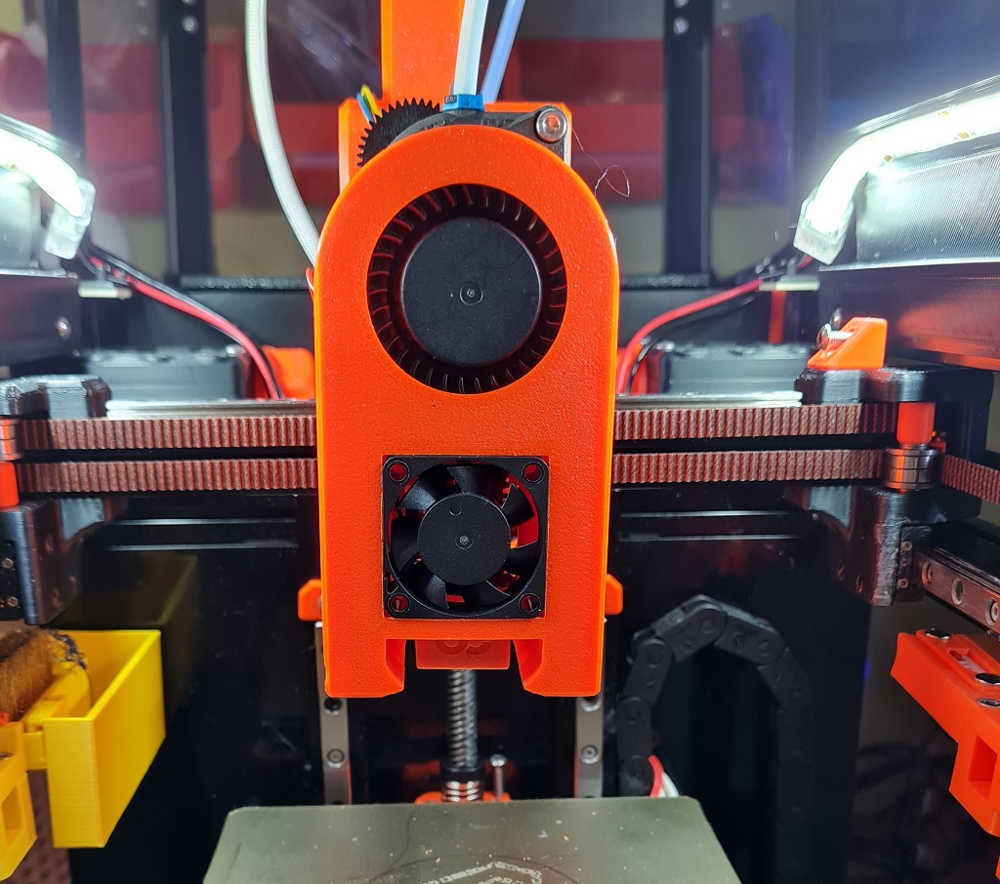
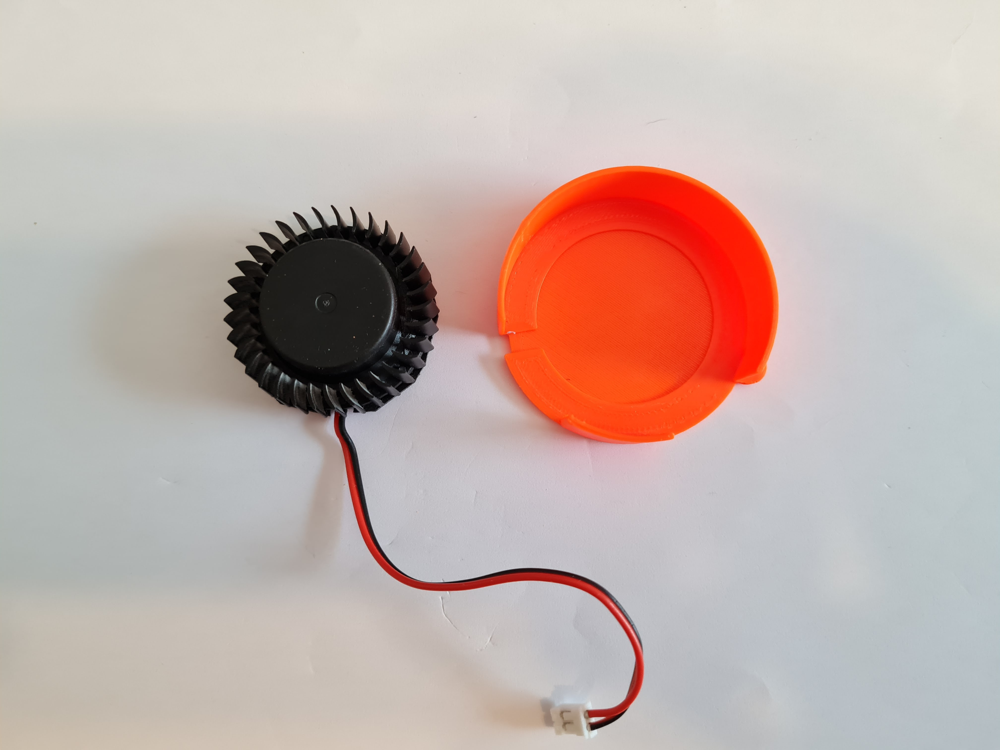
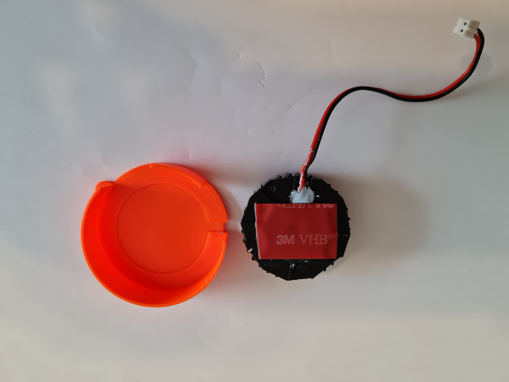
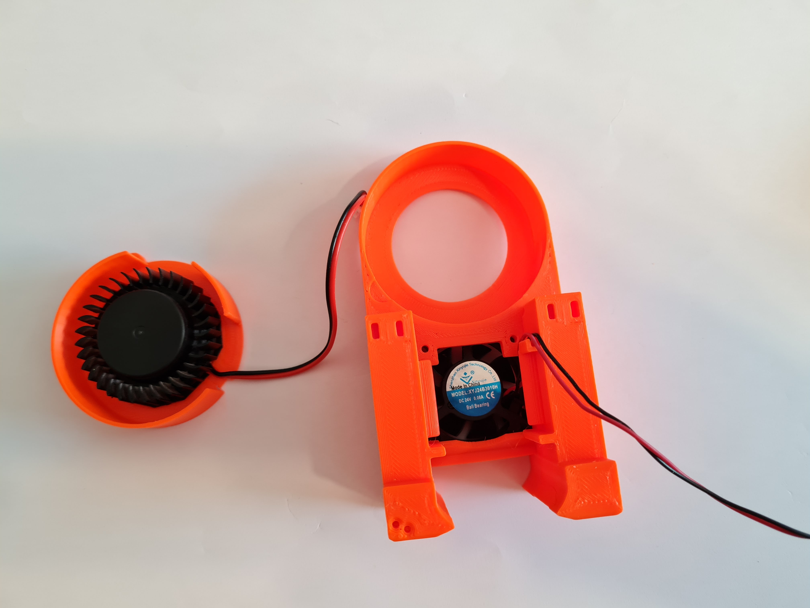
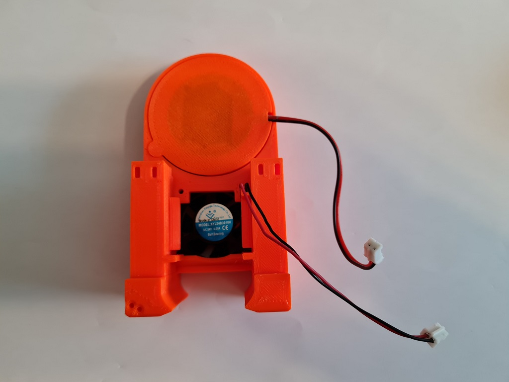
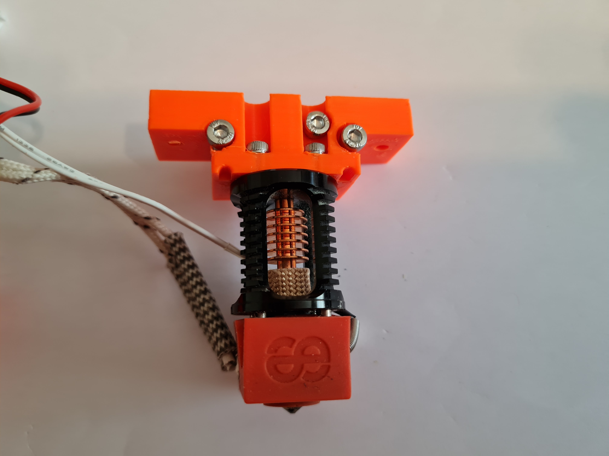
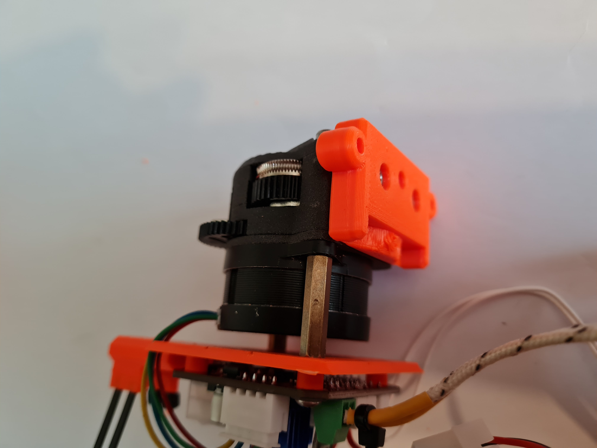
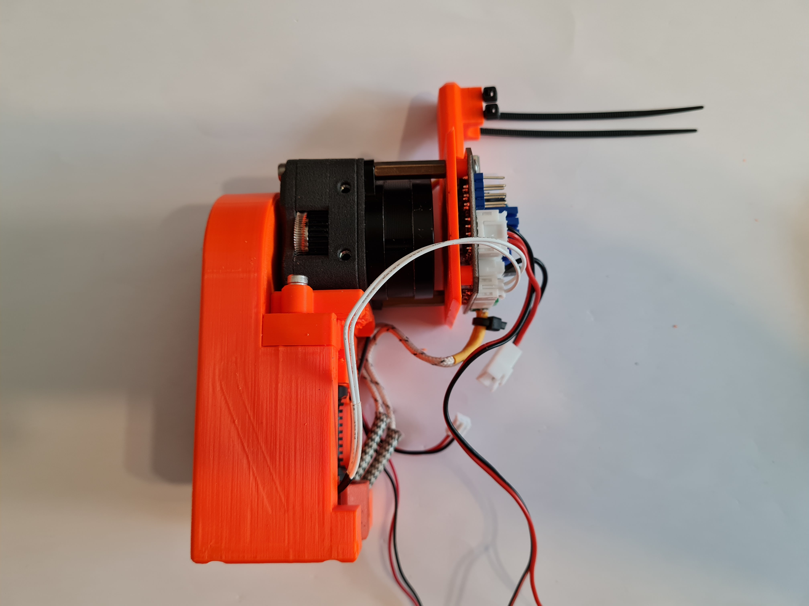
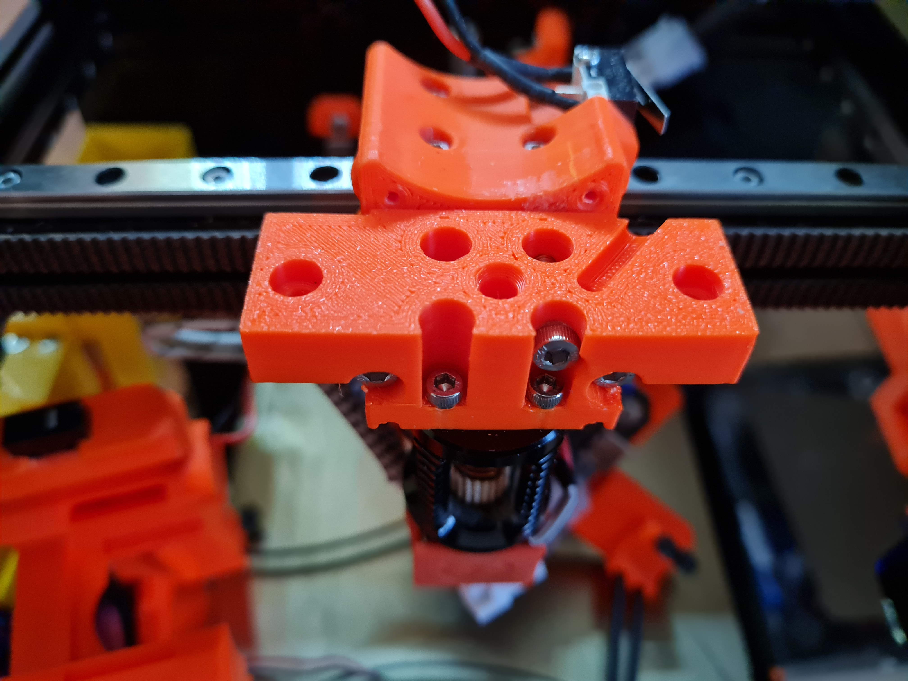

# 5015 Toolhead
This is a Voron V0.1 toolhead that uses the guts of a 5015 fan for part cooling. It currently only works with the LGX Lite extruder, but the TBG-Lite extruder will be added.

It uses the standard Voron V0.1 X carriage, is based on the [Mini-AfterSherpa](https://github.com/KurioHonoo/Mini-AfterSherpa), but I've designed it from the ground up using TinkerCad :man_facepalming:

This toolhead should not lose any X, Y or Z travel, though the standard top hat might hit on max Y due to the slant of the panels.



Please Note: This is a Work In Progress and things will likely change as issues are fixed and enhancements are made.


## Printing:

- Use the Voron defaults and print in ABS or better
- The parts are orientated correctly in the STLs
- The cowl will have different variants for choice of probe, or no probe
- Choose the mount for the specific hotend to be used

## BOM:

- 5x M3x20mm SHCS/BHCS (2 for the hotend mount, 3 for the X carriage mount)
- 2x M3x8mm  SHCS/BHCS (for the extruder mount)
- 2(4)x Brass heat inserts (2 for cowl hotend mount, 2 optional for ADXL mount)
- 1x 5015 part cooling fan that you are happy to cut to pieces
- 1x 3010 hotend fan (24v recommended)

The cowl variants will support a no probe setup, [SlideSwipe magnetic probe](https://github.com/chestwood96/SlideSwipe) and [(Un)Klicky Probe](https://github.com/jlas1/Klicky-Probe)

## Fans:

I am using these fans:

- 24v Blower 5015: [Mellow (Pengda)](https://www.aliexpress.com/item/32844339310.html)
- 24v Axial 3010: [Gdstime](https://www.aliexpress.com/item/1005002857100082.html)

## Heatsink Thermistor:

Each cowl includes a hole at the top to insert a thermistor. With this in place, klipper can track the temperature of the heatsink to watch for heat creep from the heatbreak. You can have klipper abort and shutdown before your whole toolhead melts! You only need a simple klipper entry for the appropriate pin on your MCU, e.g.:

```
[temperature_sensor Heatsink]
sensor_type: Generic 3950
sensor_pin: expander:PA5
max_temp: 85
```

Klipper will shutdown if the top of the heatsink hits 85C. You can use thermal paste to help keep a bulb thermistor in contact with the heatsink and lay the wires through the provided groove, then fitted the extruder on top to hold it in place.

## CAD:

Will be published once released from WIP.

## Assembly:

Place brass inserts into the cowl for mounting the hotend and the adxl mount if using this. Also add zip-ties to the cowl in advance of fitting the toolhead to the X carriage.

The 3010 hotend fan is meant to be press fit. If it's too tight, sand or file the opening but don't force it in otherwise it can deform and the blades will hit the casing. If it's too lose or rattles, use M3 screws to secure it through the top two holes into the cowl.

You need to remove most of the outer shell of the 5010 fan. Before doing so, please connect the fan to your MCU/toolhead board and ensure that it responds to pmw from klipper.

You need to split the 5010 fan casing in half by poking the tabs on the fan. Once done, take the half with the fan attached and carefully trim off the casing up to the fins. I use side cutters, but a craft knife should work. If more breaks off it shouldn't be a problem. What you want to be left with is a ~35mm circle of casing that matches the diameter of the actual fan. Be very careful not to cut the fan wires, or to manipulate the wires too much as they can easily break from their solder patches (a dab of hot glue helps):



Using VHB tape, cut to fit the back of the fan. You might want to remove any stickers on the back of the fan casing to ensure a good bond:



Affix the fan to the fan cap by threading the wires through the hole and centre the fan into the middle of the fan cap. It does not need to be 100% central, but the closer the better it will look:



Fit the fan cap onto the cowl and ensure that it sits well without rubbing on the cowl:



Affix your chosen hotend mount to your hotend. this must be done before mounting to the X carriage as the screws to the hotend will no longer be accessible:



Affix the extruder mount to the bottom of the extruder:



Mount the extruder on top of the hotend onto the cowl using 2 M3x20 screws to check the assembly:



Remove the extruder and hotend from the cowl. Attach the hotend assembly to the X carriage using 3 M3x20mm screws.

Offer up the cowl and extruder assembly to the hotend mount and secure using 2 M3x20mm screws. Be careful not to catch any wires between the surfaces (this step needs a bit of juggling to get everything to fit and the wires to route correctly):



Zip-tie the wires to the back of the assembly.

Plugin, test the fans and redo your X offset as it will probably have changed slightly.

## Changelog:

- 2022-06-03 WIP release
