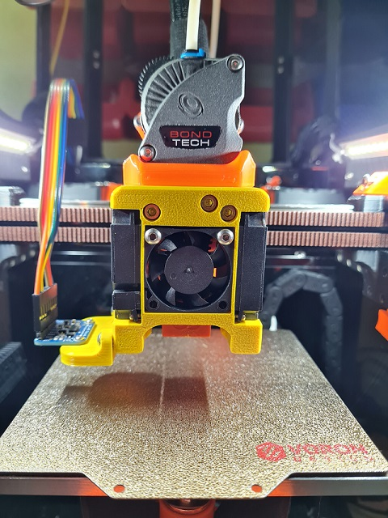

# Dragon Burner
This is my take on the Voron V0.1 toolhead. I wanted to improve the cooling of the Dragon HF hotend and provide improved part cooling when printing filament that needs it (e.g. PLA).

It uses the standard Voron X carriage, is based on the [Mini-AfterSherpa](https://github.com/KurioHonoo/Mini-AfterSherpa) and uses its extruder mounting system, but I've designed it from the ground up using TinkerCad :man_facepalming:



## Goals:

- Dragon SF and HF hotend support
- Dragonfly hotend support
- E3D Revo Voron hotend support
- Rapido HF hotend support
- Single 3010 24v hotend cooling fan
- Twin 4010 24v blower part cooling fans
- Support for the [SlideSwipe magnetic probe](https://github.com/chestwood96/SlideSwipe)
- ADXL345 mount point and board mount
- Heatsink thermistor support
- Klicky probe support
- Screwless hotend fan attachment

These have all been implemented in this public release.

NOTE: This is a Work In Progress and so CAD files will not be available until full release (i.e. once I've learnt Fusion 360)

## Additional Goals:

- Learn Fusion 360 so I can publish decent source CAD files (I've a way to go on this one, this work was done on TinkerCad)

## Printing:

- Use the Voron defaults and print in ABS or better. The part is orientated correctly in the STL.

## BOM:

In addition to the [Mini-AfterSherpa](https://github.com/KurioHonoo/Mini-AfterSherpa):

- 2x additional heat inserts (for ADXL345 mount)
- 2x M3x16mm BHCS (for hotend fan)
- 2x M3x8mm BHCS (for ADXL mount)
- 2x M2x10mm self tapping screws (for blower fans)
- 2x M2x8mm BHCS and nuts (to mount ADXL)
- 2x 4010 blower fans (24v recommended)
- 1x 3010 hotend fan (24v recommended)

The cowl supports a no probe setup, [SlideSwipe magnetic probe](https://github.com/chestwood96/SlideSwipe) and [(Un)Klicky Probe](https://github.com/jlas1/Klicky-Probe)

## Fans:

I am using these fans:

- Hotend 24v Axial 3010: [e3d-online.com](https://e3d-online.com/products/dc-fans)
- Part Cooling 24v Blower 4010: [aliexpress.com](https://www.aliexpress.com/item/32798634077.html?spm=a2g0o.productlist.0.0.32d1313eGDqZx0&algo_pvid=46f192a9-033a-4df7-98da-0f0cb011945a)

## Heatsink Thermistor:

Each cowl includes a hole at the top to insert a thermistor. With this in place touching the thermistor klipper can track the temperature of the heatsink to watch for heat creep in the heatbreak. This way, you can have klipper abort and shutdown before your whole toolhead melts! You only need a simple klipper entry for the appropriate pin on your MCU, e.g.:

```
[temperature_sensor Heatbreak]
sensor_type: Generic 3950
sensor_pin: expander:PA5
max_temp: 75
```

With this, klipper will shutdown if the top of the heatsink hits 75C (i.e. below the glass transition of ABS). I used thermal paste to help keep a bulb thermistor in contact with the heatsink and layed the wires through the provided groove, then fitted the extruder on top to hold it in place.

## Assembly:

- If you are using one of the Klicky variants, add the wires and magnets to the toolhead
- Add ADXL mount inserts to the lower outside left of the toolhead
- There is a hole on the left face to put the left 4010 blower fan cable through, do this before going further
- Insert the 3010 hotend fan and route both fan cables through the provided channel
- Secure the 3010 fan either using the fan nubs[*], or use 2 FHCS (the fan will need to be chamfered) or BHCS screws
- Take care when screwing the hotend fan as it's secured into plastic and too much force will strip the created threads and/or deform the fan
- Be careful not to leave the cables loose or over the hotend mount
- Insert the 4010 fans into each side and slide backwards into the restraints
- Secure each fan using a M2x10mm self tapping screw at the bottom front hole
- Carefully mount the hotend into place making sure not to pinch any fan cables
- Run the hotend and fan cables along the 10mm side of the 4010 fans on each side and zip tie at the top
- Fit the heatbreak thermistor if you are going to use one
- Fit your extruder
- Offer up to the toolhead mount and secure, being careful not to trap any of the cables
- Check the X and Y movement still triggers the end-stops and that none of the cables are causing the belts to bind to the x axis
- Check you have modified all the fan connections on the MCU if you have switched to higher voltage fans

[*] NOTE: You may lose 1-2mm on the Y axis when using BHCS screws. To reclaim most of that loss, instead use the fan nubs. These are inserted after placing the 3010 fan into the housing from the sides with the domes pointing inwards. The 4010 fans will then hold these in place. If you need to remove the 3010 fan, remove the 4010 fans first, then carefully screw in a short M3 screw into the holes in the centre of the nubs to extract. If either the 3010 fan does not have indents or if it rattles, then you will have to use 2 screws instead to secure the fan. You can use BHCS screws, or to regain some of the Y loss, use FHCS screws. You can then chamfer the insides of the top two fan screw holes to allow the FHCS screws to be flush against the fan and cowl.

## Changelog:

- 2022-04-12 First release
- 2022-04-12 Fixed issue with incorrect part placement
- 2022-04-13 Added mounts for the Dragonfly hotend
- 2022-04-13 Added mounts for the Rapido HF hotend
- 2022-04-13 Fixed clearance to socks on Rapido and Dragonfly
- 2022-04-16 Fixed misalignment of filament tube hole for Dragonfly
- 2022-04-16 New ducts improve airflow over nozzle
- 2022-04-19 New ducts improve airflow direction
- 2022-04-19 Added hole and wire groove for heatsink thermistor
- 2022-04-21 Added Klicky variant support
- 2022-04-21 Reorganised repo to separate hotends
- 2022-04-21 Added screwless 3010 hotend fan mount
- 2022-04-27 Added mounts for the E3D Revo Voron hotend
