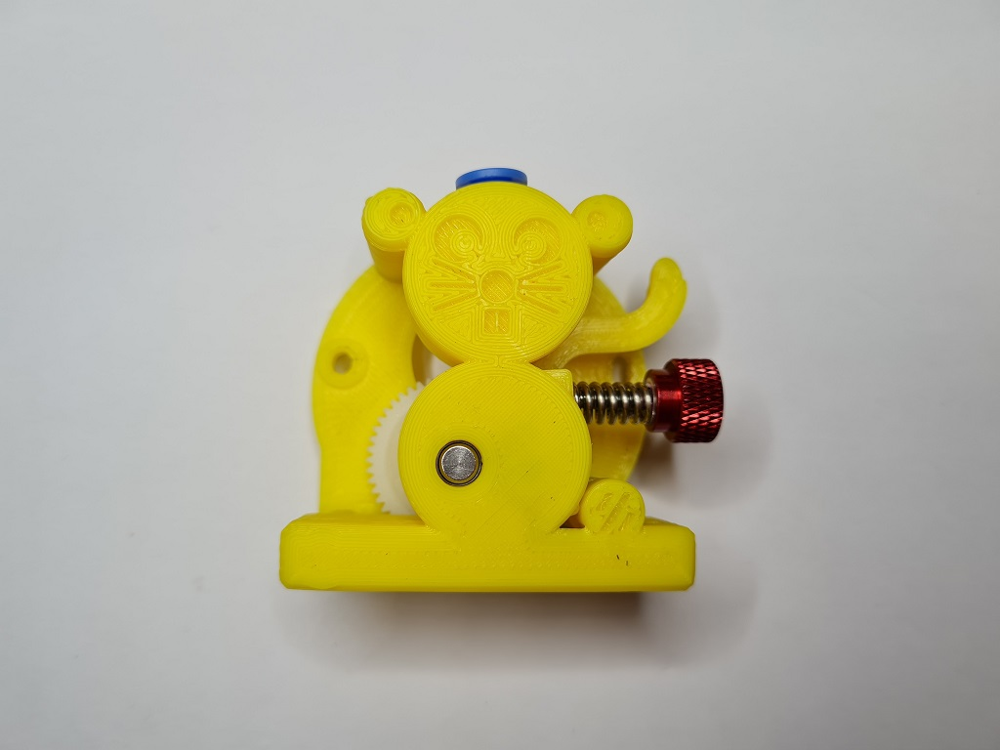
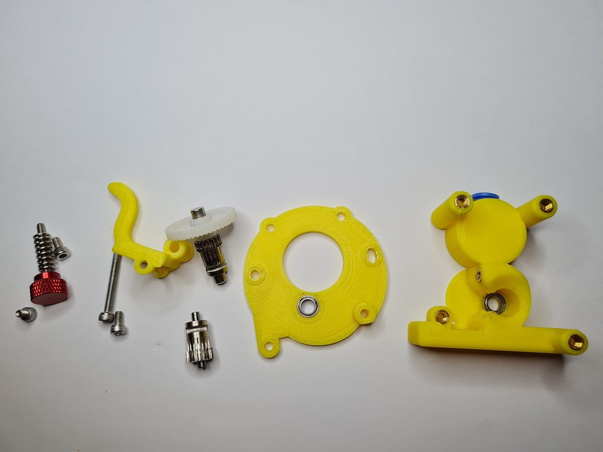
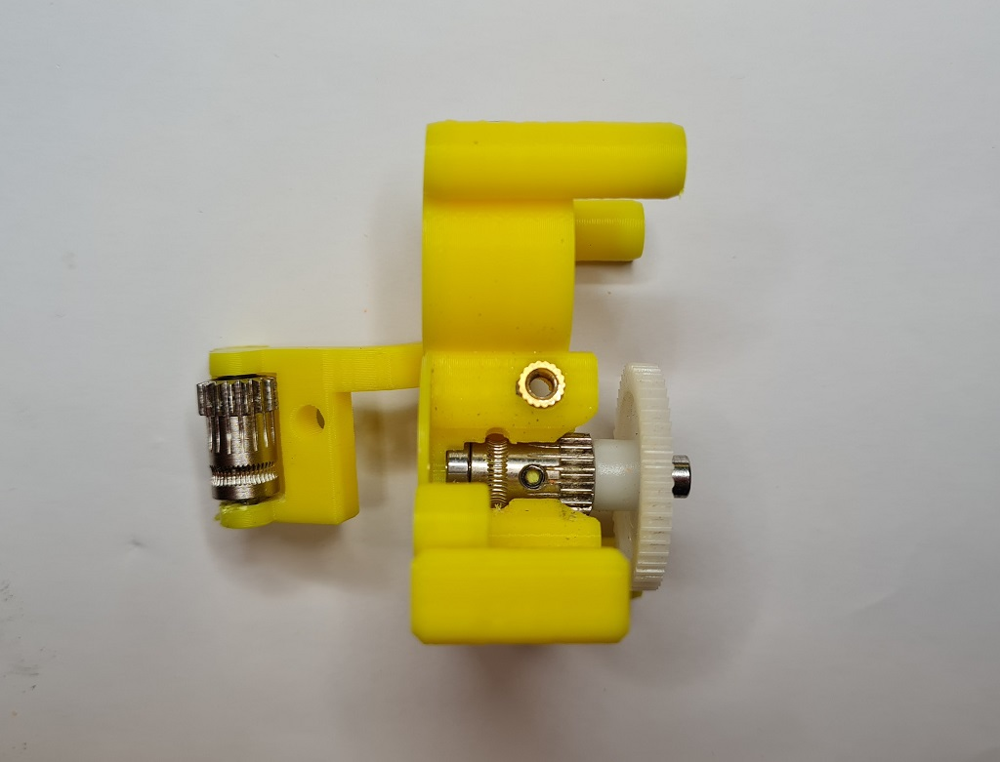

# MiniMouse Direct Extruder

The MiniMouse is a direct drive extruder designed for the Voron v0.1

It uses the mounts from the [Mini-AfterSherpa](https://github.com/KurioHonoo/Mini-AfterSherpa) and works with both of my toolheads: [Dragon Burner](https://github.com/waytotheweb/voron/tree/main/V0/Dragon_Burner) and [5015 Toolhead](https://github.com/waytotheweb/voron/tree/main/V0/5015_Toolhead)

