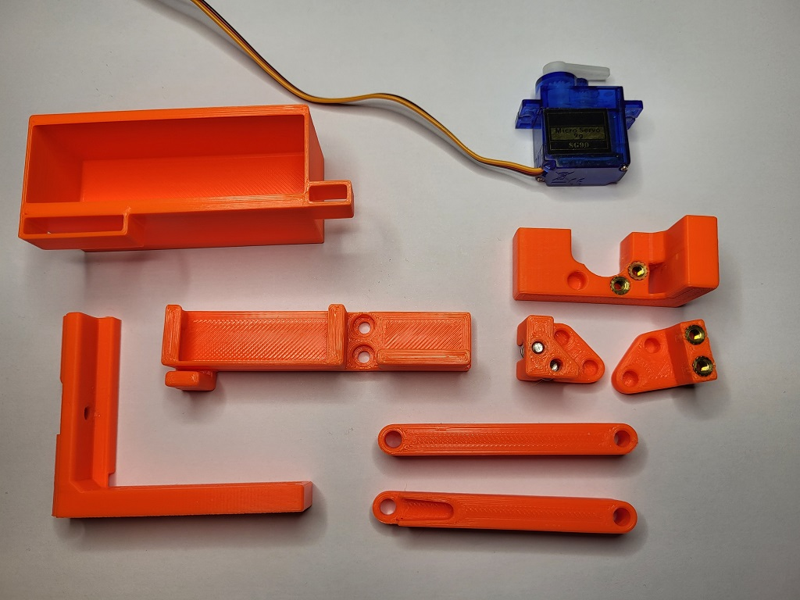
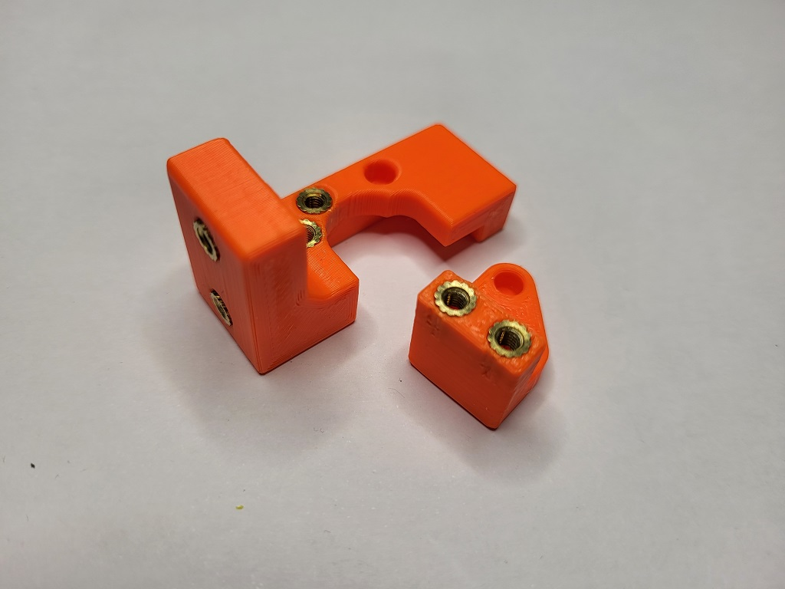
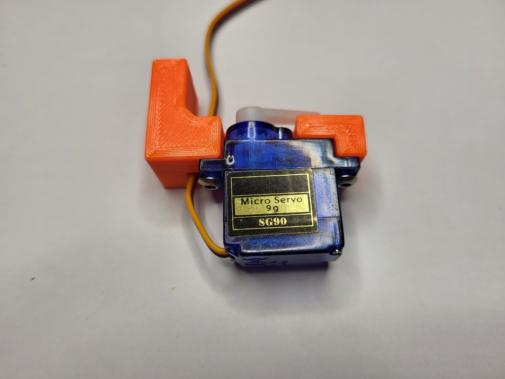
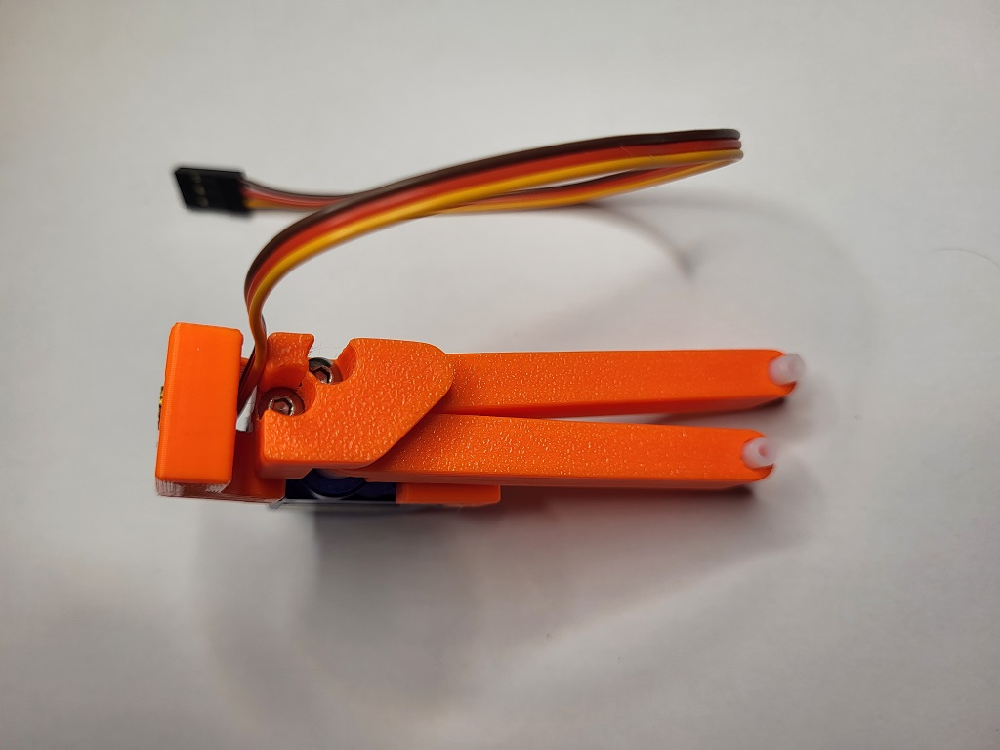
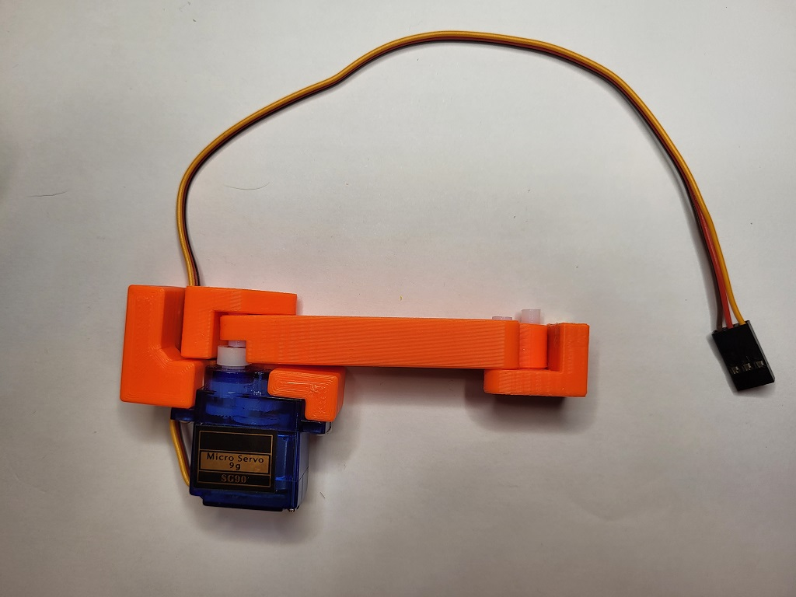
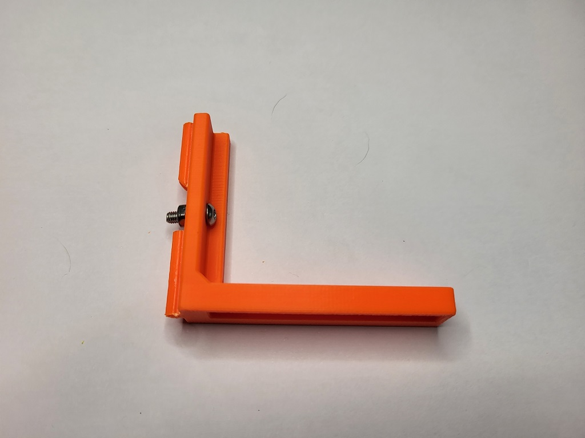
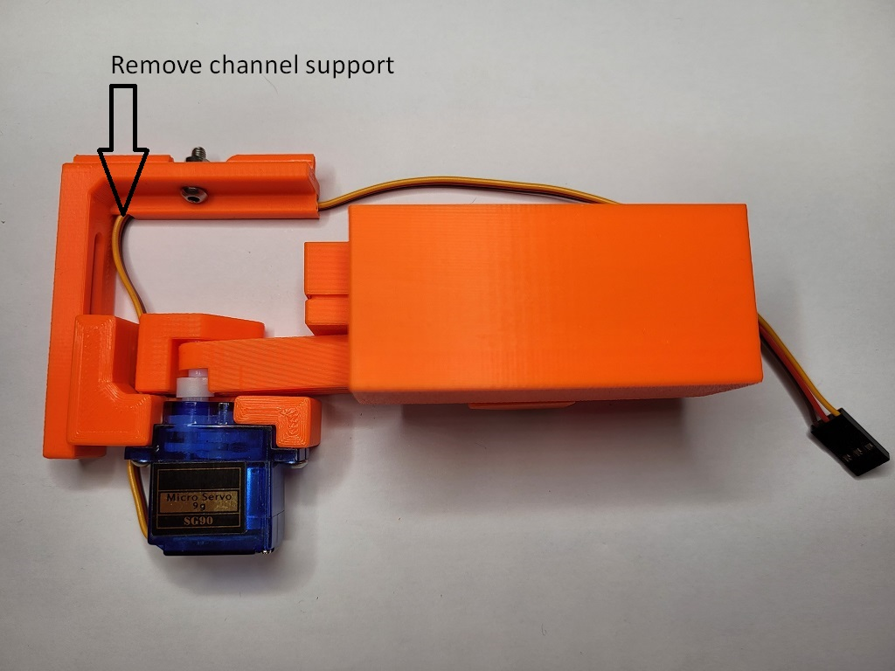

# Nozzle Wiper v2

This is a nozzle purge and wipe mod for the Voron V0.1. It is based on the [SlideSwipe](https://github.com/chestwood96/SlideSwipe) magnetic probe.

It uses a snap in frame clip to attach a servo that extends a bucket and brush over the build plate for the hotend nozzle to clean it of filament debris for cleaner prints.


## Features:

- Servo used to extend system over the print bed
- Bucket and brush to clean nozzle
- Snap in frame clip that attaches to the left Y extrusion
- Klipper macros to control the entire process

## Printing:

- Use the Voron defaults and print in ABS or better
- The parts are orientated correctly in the STLs

## BOM:

- 1x Micro Servo 9G Servo Motor (SG90 or MG90 - mounts are provided for both)
- 6x M3x4x5mm Heat inserts
- 8x M3x8mm BHCS (2 for servo joint, 2 for carrier joint, 2 for frame mount)
- 1x M3x10mm BHCS (for frame mount)
- 1x M3 nut (for frame mount)
- 1x Nozzle cleaning brush in Copper
- 3x OD 4mm, length 16mm, PTFE tube
- 1x OD 4mm, length 7mm, PTFE tube

## Hardware:

Brush:
https://www.amazon.co.uk/gp/product/B08H8SXBKM
https://www.aliexpress.com/item/4000801101276.html

Servo:
https://www.amazon.co.uk/gp/product/B0972M7JN1
https://www.aliexpress.com/item/1005001956791642.html

## Assembly:



Take the servo and attach a single arm to the top. Slowly and gently rotate the rotor clockwise until it hits its limit. Remove the arm and replace it on the servo so that it is positioned slightly more than 90 degrees clockwise as shown in the picture above.

This sets the servo arm to its 0 position. Use the smallest screw in the servo packaging to affix the arm to the servo in that position.

Place the 6 heat inserts as shown:



Remove the support tabs from the bucket. There is also a small support tap at the corner of the frame mount (see image at the bottom)


Cut down the brush head so that it matches the internal width of the brush holder. It's soft plastic so can be cut with a craft knife or a pair of angle cutters.


Cut the PTFE tube into 3 lots of 16mm and 1 lot of 7mm. These will act as the hinges.

Push the cable connector through the slot provided in the servo mount as this will run on the inside of the extrusion. Fit the servo into the mount and fix in place with 2 M3x8mm screws. Don't overtighten:



Place 1 of the 16mm piece and the 7mm piece of PTFE tubing into the servo arm. Pace 2 of the 16mm pieces of PTFE tubing into the parallel arm


This is a little fiddly: Position the servo arm with the short tube over the servo arm and the parallel arm next to it:


Then screw in the servo joint using 2 M3x8mm screws. Do not tighten too much or the arm on the servo will bind (clicking noise). Make sure the arms rotate freely:



Fit the carrier joint to the ends of the arms:



Attach the tool carrier to the carrier joint using 2 M3x8mm screws:


Attach the bucket to the tool carrier and make sure it goes on and comes off freely. If there's any stiffness, sand the bucket mounts on the tool carrier gently:


Place the M3x10mm screw through into the frame mount and wind on the nut about 2mm:



Attach the frame mount to the servo mount using 2 M3x8mm screws through the groove. Do not tighten these screws, the servo mount should slide up and down the frame mount for now:



Fit the brush head into the tool carrier.

Slowly and carefully, manually extend and straighten the arm to ensure a full range of motion:


Before permanently mounting the nozzle wiper to the printer test whether it works as expected by wiring the servo to the MCU from outside of the printer.

- Red wire    = +5v
- Brown wire  = GND
- Orange wire = signal pin

There are various choices for connecting the servo to the MCU. Here will will refer to the BTT SKR Mini E3 V2.0.

Always turn off the printer before connecting or removing anything to or from the MCU.

The simplest is to connect to the Neopixel or E0-STOP connector if it is not in use as it provides all 3 required connections. Alternatively, a [Klipper Expander](https://github.com/timmit99/Klipper-Expander) can be used if there are no free pins.

Remember, do not fit the arm to the printer at this point.

Upload the nozzlewiper.cfg file to your klipper configuration directory on the raspberry pi. If using Mainsail you can do this in MACHINE > Upload File.

Now edit printer.cfg and add an include line to the Macro section of your configuration:

```[include nozzlewiper.cfg]```

Modify nozzlewiper.cfg "[servo wipeServo]" and set the correct pin that you attached the single wire for the servo to. For example, PA8 would be on the Neopixel, PC15 would be the E0-STOP.

Now power on the printer. Once it has fully booted, you should see a list of new macros available all prefixed with "NW". You may need to home the server first.

Holding the nozzle wiper firmly in the hand by the extrusion mount, run the "NW DEPLOY" macro. The arm should extend 90 degrees. Then run the "NW RETRACT" macro and the arm should move to an almost straight position. It will not be completely straight as this helps prevent the arm+bucket from hitting the printers side panel.

Shutdown the printer.

Fit the Nozzle Wiper under the left Y extrusion: Feed the cable up through the provided routing on the frame mount. Then angle the frame mount into into the groove on underside of the left Y extrusion and push firmly so it snaps into place. Slide the assembly until the end of the tool carrier/bucket is ~5mm from the back panel. Now screw the fitted M3x10mm on the frame mount into the extrusion. Don't overtighten, it only needs small amount of contact to hold the Nozzle Wiper in place


You can route the cable along the extrusion. The cable should just fit through into the electronics bay, but you will likely need to remove the DuPont connector by lifting the taps to free the pins. You can then push the cable through and wire it to your MCU.

Follow the steps in the nozzlewiper.cfg file to configure the nozzle wiper setup.

## v1 Changelog:

- 2022-05-04 First release
- 2022-07-11 Added STEP CAD
- 2022-07-25 Improved printability of STL parts

## v2 Release:

- Use heat inserts instead of screwing into plastic for most screws
- Larger purge bucket
- More compact design
- Support both SG90 and MG90 motors
- New mounting system to support v0.1 variants, such as the Tri-Zero
- Improved cable routing


## v2 Changelog:

- 2022-08-21 First release
