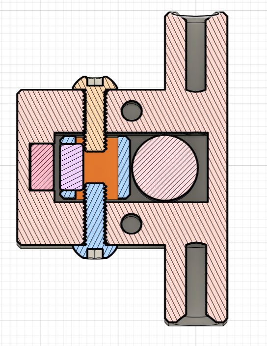
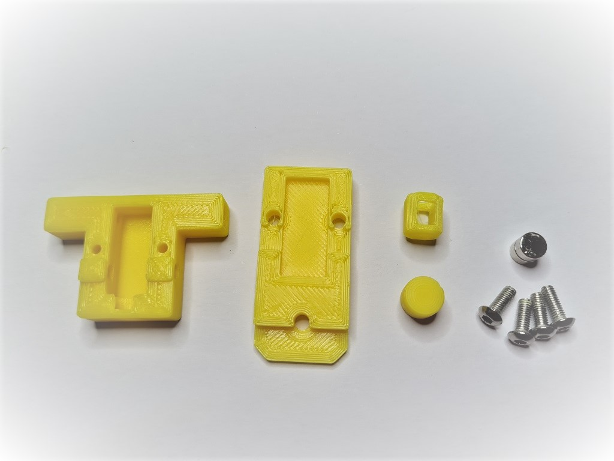
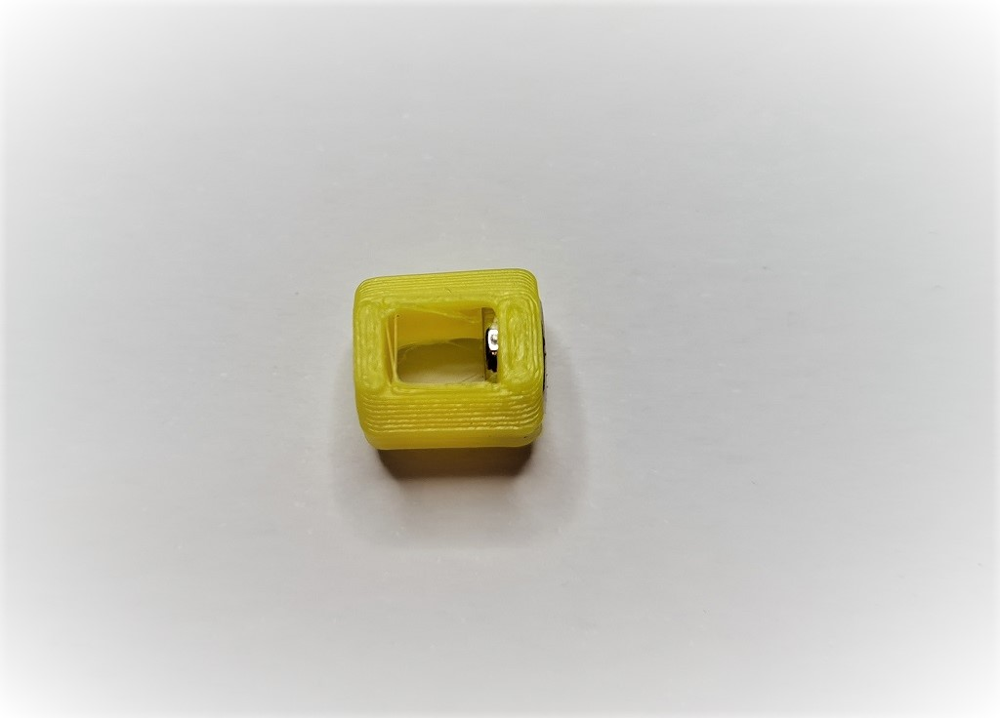
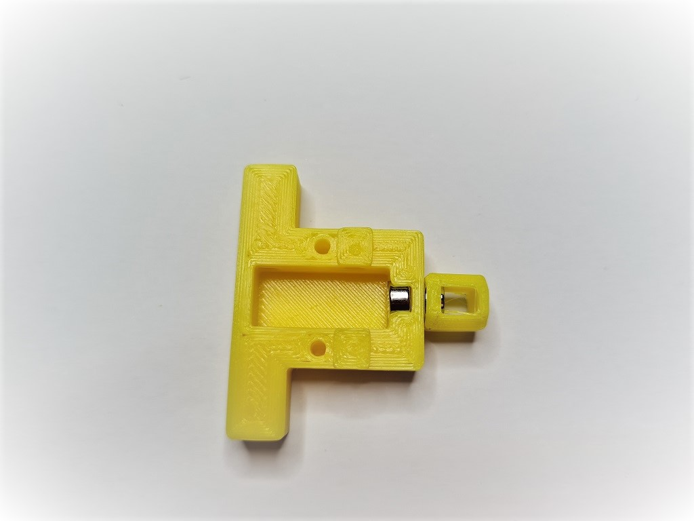
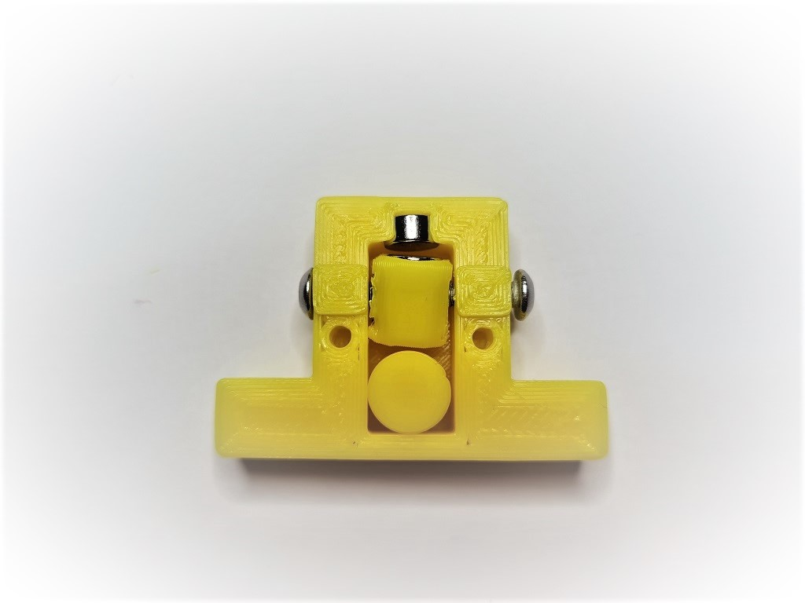
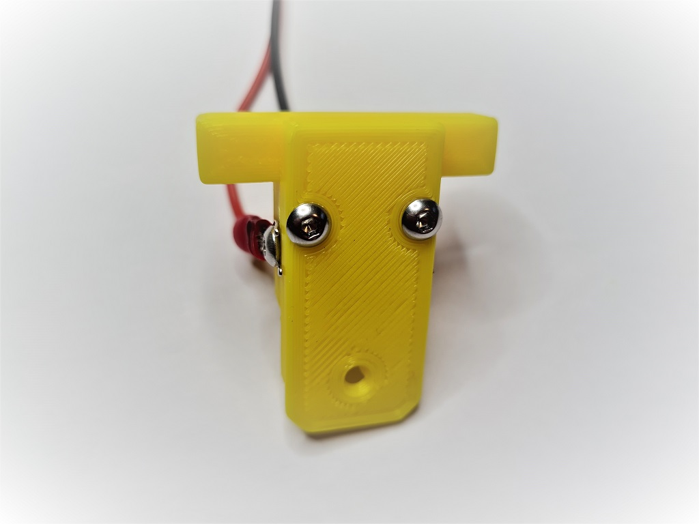
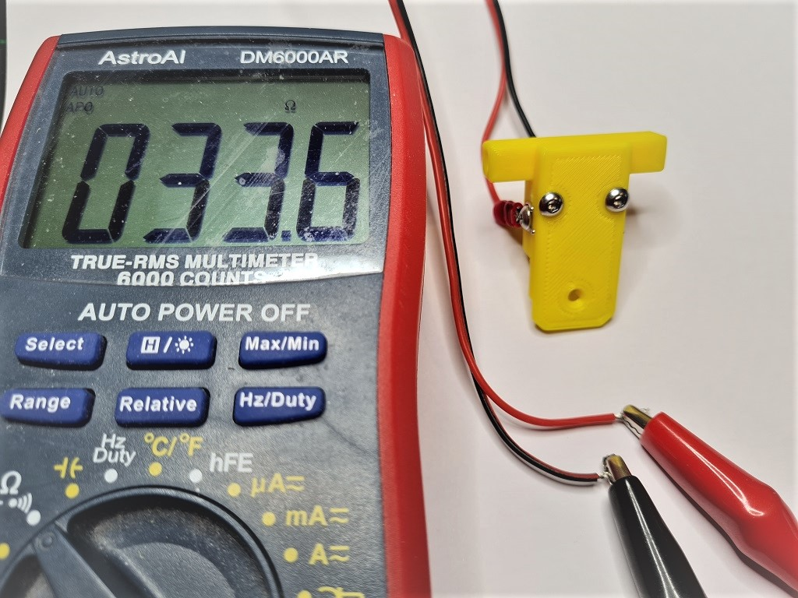
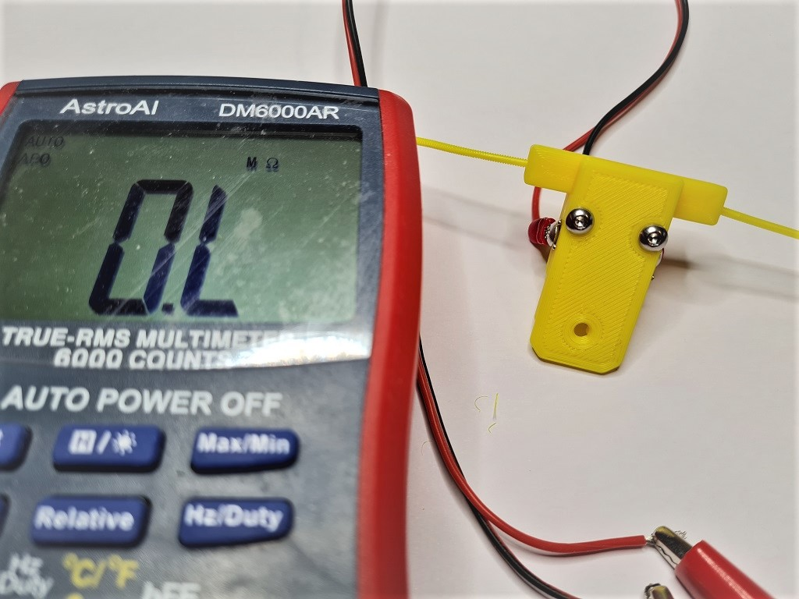

# Runout UnKlicky Sensor

The Runout UnKlicky Sensor is a filament runout sensor that can be used to pause a print if printing filament breaks, runs out or otherwise is no longer present in the sensor.

The design uses magnets as the switch, making it easy and cheap to source BOM components.

## Printing:

- Use the Voron defaults and print in ABS or better
- The parts are orientated correctly in the STLs

### Base and Top

There are 3 bases and 4 tops to choose from:

Bases:

- Base.stl is the standard base with push in holes for the PTFE tubes
- Base_PC4-M6.stl which allows the use of PC4-M6 connectors for the PTFE tubes
- Base_Collet.stl which allows the use of [E3D M4 collets](https://e3d-online.com/products/embedded-bowden-collet-for-metal-1-75mm)

Tops:

- Top.stl is the standard top with no mounting options
- Top_2020.stl provides mounting to 2020 extrusions
- Top_1515.stl provides mounting to 1515 extrusions
- Top_1515_NoNut* provides mounting to 1515 extrusions if you have no inserted nuts available

[*] The Top_1515_NoNut can be used if you don't have any free nuts. It snaps into the extrusion. If it moves or slips, you can use a M2x10mm self-tapping screw to secure the sensor to the extrusion. Do note that the screw can scratch the inside the extrusion if that might bother you.

## BOM:

- 5x M3x8mm SHCS/BHCS (2x for the wired screws, 2x for the top/base, 1x for 2020 extrusion mount)
- 2x 6x3mm neodymium magnets (for the switch)
- 1x M2x10mm (optional for 1515 extrusion mount)
- 1x M3 Hammer T-Nut (for 2020 extrusion mount)
- 2x fork connectors (optional - for attaching wires)

## Assembly:

## Wiring:

Wire to an end-stop or similar pin. Do _not_ connect to voltage, _only_ to pin and GND.

Upload and include runoutunklicky.cfg and change the PIN definition. Test. If it shows incorrectly in klipper add a ! in front of the PIN definition and test again.
