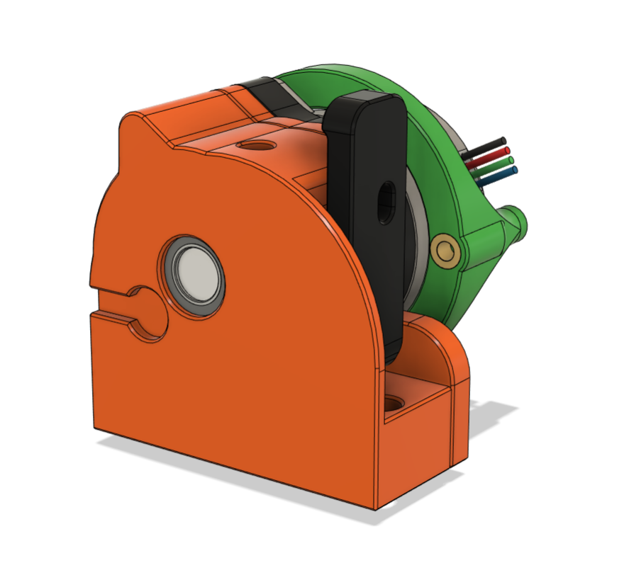
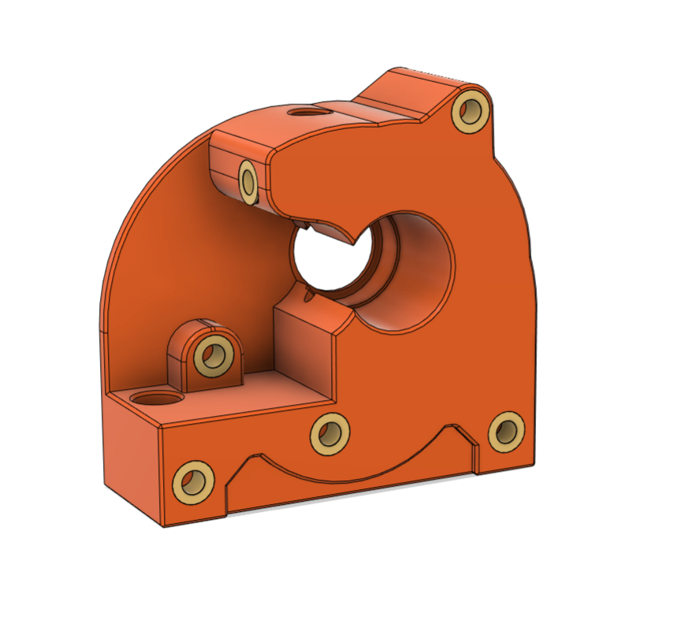
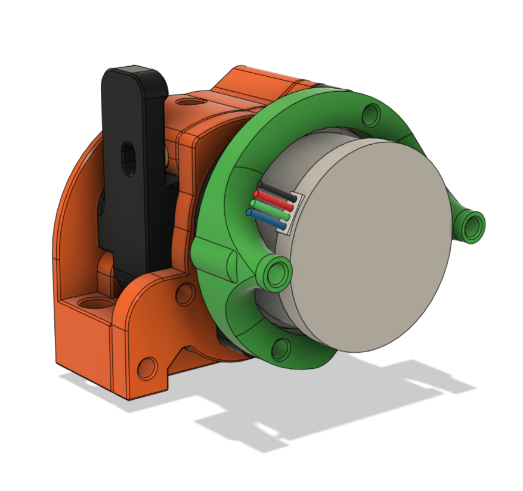

# RoundOHouse Direct Extruder

The RoundOHouse is a direct drive extruder designed for the Voron v0.1 that uses the guts of an Orbiter v2.0

It uses the mounts from the [Mini-AfterSherpa](https://github.com/KurioHonoo/Mini-AfterSherpa) and was designed to complement the [5015 Toolhead](https://github.com/waytotheweb/voron/tree/main/V0/5015_Toolhead) toolhead. It can be used on any toolhead that uses the [Mini-AfterSherpa](https://github.com/KurioHonoo/Mini-AfterSherpa) design.

Please Note: This is a Work In Progress and things will likely change as issues are fixed and enhancements are made.

## Printing:

- Use the Voron defaults and print in ABS or better
- The parts are orientated correctly in the STLs

## BOM:

- 8x Brass heat inserts (6 for the front, 2 for the support ring)
- 1x Orbiter v2 Extruder
- 1x NEMA14 36mm pancake Motor with 10 tooth gear
- 1x UM2 Collet (optional)

## Sources:

- BMG Extruder Kit, e.g. [AliExpress](https://www.aliexpress.com/item/4000021186440.html) or direct from Bondtech
- ECAS04 Embedded Collet, e.g. [Aliexpress](https://www.aliexpress.com/item/1005002538357279.html)

## CAD:

Will be published once released from WIP.

## Assembly:

Instructions to follow...

